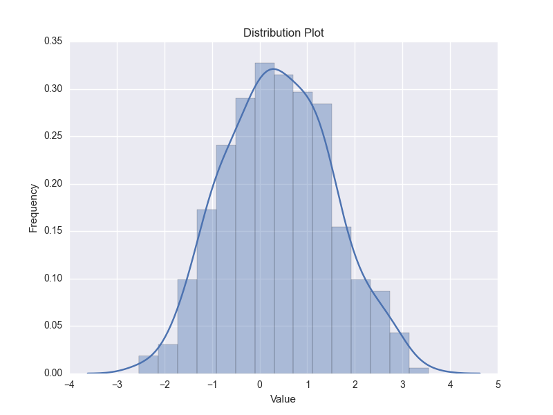

# Plot utilities 
	
## plot_distribution.py

Distribution plot using seaborn

Example: distribution of sequence length 

	cat ../sequence/seq.fa | fasta2tab -l | cut -f 3 |  \
		plot_distribution.py -t "Disribution of sequence length" -x "sequence length" -o pic.png

Sample output:

## plot_heatmap.R

Plot heatmap with *pheatmap*

Usage

    usage: ./plot_heatmap.R [-h] [-H] [-F field_seperator] [-a] [-al]
                            [--title title] [-s scale] [-ncr] [-ncc] [-c color]
                            [-nrc] [--width width] [--height height]
                            [-thr treeheight_row] [-thc treeheight_col]
                            [-fo fontsize] [-fr fontsize_row] [-fc fontsize_col]
                            infile outname
    
    Plot heatmap. Infile should be a csv/tsv file with header containing column names. Annotation for row is also supported, please put them in the last column.
    
    positional arguments:
      infile                infile (tsv, with head
      outname               outname
    
    optional arguments:
      -h, --help            show this help message and exit
      -H, --header          header
      -F field_seperator, --field-seperator field_seperator
                            field seperator
      -a, --with-annot      add annotation_row from the last column
      -al, --with-annot-legend
                            show annotation_row_legend
      --title title         title
      -s scale, --scale scale
                            scale. row | column | none [row]
      -ncr, --not-cluster-rows
                            do not cluster_rows
      -ncc, --not-cluster-cols
                            do not cluster_cols
      -c color, --color color
                            sequential palettes names [RdYlBu]
      -nrc, --not-reverse-color-order
                            do not reverse color order
      --width width         output image width
      --height height       output image height
      -thr treeheight_row, --treeheight_row treeheight_row
                            treeheight_row
      -thc treeheight_col, --treeheight_col treeheight_col
                            treeheight_col
      -fo fontsize, --fontsize fontsize
                            fontsize
      -fr fontsize_row, --fontsize_row fontsize_row
                            fontsize_row
      -fc fontsize_col, --fontsize_col fontsize_col
                            fontsize_col
                            
Sample output:

