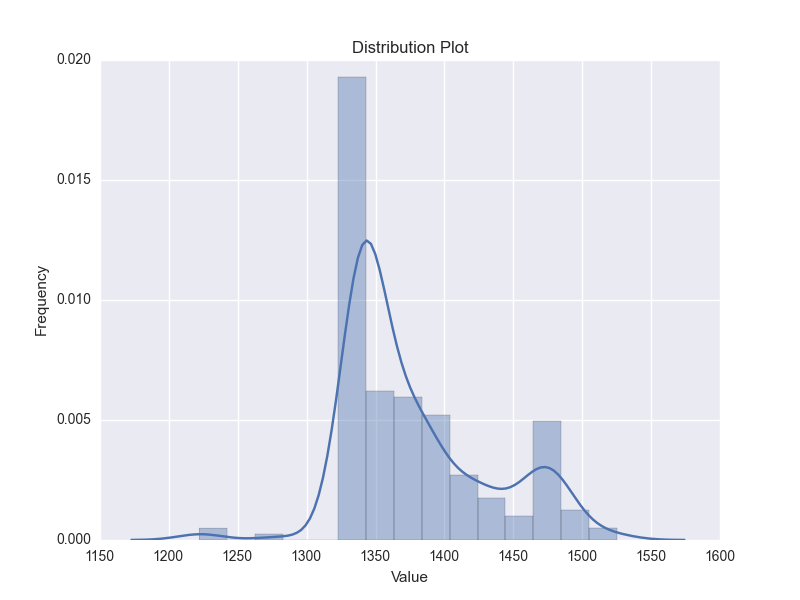

# Utilities 

## csv_grep

grep CSV file, tab-delimited file by default, by exactly matching or query by
regluar expression. The query patterns could be given from command line or file.
Column number of key in target file or pattern file is settable.

### Usage:

	usage: csv_grep [-h] [-v] [-o [OUTFILE]] [-k KEY] [-H] [-F FS] [-Q QC]
					[-p [PATTERN]] [-pf [PATTERNFILE]] [-pk [PK]] [-r] [-s] [-n]
					[csvfile [csvfile ...]]

	Grep CSV file

	positional arguments:
	csvfile               Input file(s)

	optional arguments:
	-h, --help            show this help message and exit
	-v, --verbose         Verbosely print information
	-o [OUTFILE], --outfile [OUTFILE]
							Output file [STDOUT]
	-k KEY, --key KEY     Column number of key in csvfile
	-H, --ignoretitle     Ignore title
	-F FS, --fs FS        Field separator [\t]
	-Q QC, --qc QC        Quote char["]
	-p [PATTERN], --pattern [PATTERN]
							Query pattern
	-pf [PATTERNFILE], --patternfile [PATTERNFILE]
							Pattern file
	-pk [PK]              Column number of key in pattern file
	-r, --regexp          Pattern is regular expression
	-s, --speedup         Delete matched pattern, if you know what it means
	-n, --invert          Invert match (do not match)

### Examples

1) For a table file. Note that the 3rd column of 4th line contains "\t".

	$ cat testdata/data.tab
	column1 column 2        3rd c
	str     123     abde
	123     134     我
	245     135     "string with    tab"

Find lines of which the 2nd columns are digitals, ignoring title

	$ cat testdata/data.tab | csv_grep -H   -k 2    -p '^\d+$'   -r
	str     123     abde
	123     134     我
	245     135     "string with    tab"

	
Find lines that have ID (first column, by default) in (or NOT in) a given ID files.

	$ cat testdata/data.tab | csv_grep -pf testdata/data.pattern.tab
	123     134     我
	
	$ cat testdata/data.tab | csv_grep -pf testdata/data.pattern.tab -n
	column1 column 2        3rd c
	str     123     abde
	245     135     "string with    tab"

2) Find common records with same headers in two fasta files. 
[*fasta2tab*](https://github.com/shenwei356/bio_scripts/blob/master/sequence/fasta2tab) 
 transforms the FASTA fromat to two-column table, fist column is the header and the second is sequence. 
[*tab2fasta*](https://github.com/shenwei356/bio_scripts/blob/master/sequence/tab2fasta) just tranform the
table back to FASTA format.
	
	fasta2tab seq1.fa | csv_grep -pf <(fasta2tab seq.fa) | tab2fasta
	
Records with same sequence (second column).

	fasta2tab seq1.fa | csv_grep -pf <(fasta2tab seq.fa) -pk 2  -k 2  | tab2fasta

3) Find common records of two GTF file.
The columns 1,4,5,7 together make up the key of a record,
so we add a new column as the key and remove it at last.

	awk -F"\t" '{print $0"\t"$1""$4""$5""$7}' c.gtf > c1.gtf
	awk -F"\t" '{print $0"\t"$1""$4""$5""$7}' d.gtf > d1.gtf
	cat c1.gtf | python3 csv_grep -k 10 -pf d1.gtf -pk 10 | awk 'NF-=1' > common.gtf
	
## plot_distribution.py

Distribution plot using seaborn

Example: distribution of sequence length 

	cat ../sequence/seq.fa | fasta2tab -l | cut -f 3 |  \
		plot_distribution.py -t "Disribution of sequence length" -x "sequence length" -o pic.png

Sample output:

